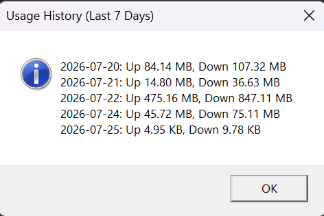
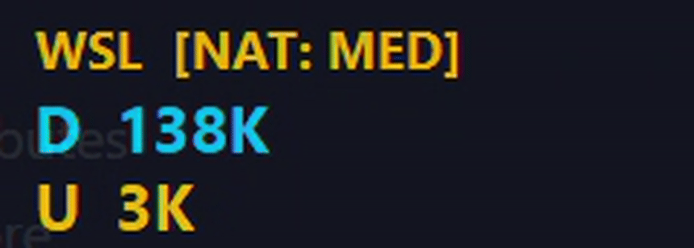

# WSL Traffic Monitor



WSL Traffic Monitor is a lightweight native Windows application for measuring WSL2 network traffic and showing real-time upload/download speeds in a tray/taskbar interface.

This repository contains a full **v0.5.0 Pre-Release**. It includes the core NAT-mode traffic sampler, native Windows system tray UI with Per-Monitor V2 DPI awareness, high-DPI floating display overlay, rolling usage history (`redb` backed), strongly-typed error architecture, and automated release pipeline.

### Known Limitations
- **Windows Smoke-Testing**: The tray icon, floating overlay, and history persistence are feature-complete. Extended validation for long-running uptime, Explorer restarts, and Windows network-change events is tracked in `docs/windows_smoke_test_checklist.md`.
- **Docker Desktop**: Docker installations and WSL backend VMs are detected to improve confidence scoring, but their NAT traffic is currently blended with regular WSL traffic and is not explicitly separated.
- **Networking Modes**: NAT mode is fully supported for host-side tracking. Mirrored, VirtioProxy, and `none` modes are detected in `.wslconfig` and safely reported as unsupported without mutating user config.
- **Code Signing**: Official release binaries are currently unsigned self-built binaries from GitHub Actions CI.

## Current Status

- **Phase 0, 1 & 2 (Completed)**: Fully native Windows tray application running in the background. It monitors WSL NAT traffic, records rolling history in a `redb` database, and offers a right-click UI for diagnostics, history, and settings.
- **Phase 3 (Completed / Read-Only Safety)**: Mirrored networking, VirtioProxy, and disabled networking are explicitly detected and reported as `UnsupportedNetworkingMode` with visual UI warnings, keeping `.wslconfig` strictly read-only.
- **Phase 5 (v0.5.0 Pre-Release in Progress)**: GitHub Actions release workflow (`.github/workflows/release.yml`) builds Windows release binaries, SHA-256 checksums, and publishes tagged GitHub Releases (`v0.5.0`).
- **Floating Display Overlay**: Compact, glanceable, borderless desktop card showing real-time upload/download speeds and confidence status (`[NAT: HIGH]`). Features position persistence, ClearType rendering, and draggable placement.
- **Typed Error Architecture**: Strongly typed error enums across 6 workspace crates (`WindowsError`, `WslError`, `StorageError`, `MonitorError`, `DiagnosticsError`, `UiError`).
- **Cross-Compilation**: Verified target compilation for both Linux and Windows (using `x86_64-pc-windows-gnu`).
- **Tests & Lints (Clean)**: All 30 unit tests pass, free of clippy/rustc warnings.

## Demo



## Running the Application & Harness

To cross-compile the Windows binaries from a Linux environment:
```bash
cargo build --release --target x86_64-pc-windows-gnu
```
The application binary will be generated at `target/x86_64-pc-windows-gnu/release/wsl-traffic-monitor.exe`.

To run the application or diagnostic utility on a Windows host:
```cmd
# Run background monitor & UI overlay:
wsl-traffic-monitor.exe

# Export report in structured JSON format:
wsl-traffic-monitor.exe --json
```

## Workspace Layout

- `apps/wsl-traffic-monitor`: Application entry point and CLI diagnostic flags.
- `crates/wsl-traffic-core`: Shared domain types, speed formatting, and constants.
- `crates/wsl-traffic-windows`: Native Win32 API bindings (`GetIfEntry2`, registry, autostart).
- `crates/wsl-traffic-wsl`: WSL discovery, distribution parsing, and read-only `.wslconfig` inspector.
- `crates/wsl-traffic-monitor`: Core sampling engine, candidate classification, and state machine.
- `crates/wsl-traffic-ui`: System tray UI, context menus, and floating display overlay.
- `crates/wsl-traffic-storage`: User settings serialization and `redb` history database.
- `crates/wsl-traffic-diagnostics`: Diagnostic report generator and text/JSON export.
- `crates/wsl-traffic-agent-protocol`: Shared protocol types for optional guest communication.

## Development

Required:

- Rust stable, 1.85 or newer.

Useful commands:

- `cargo fmt --all -- --check`
- `cargo clippy --workspace --all-targets -- -D warnings`
- `cargo test --workspace --all-targets`
- `cargo doc --workspace --no-deps`

## Documentation

- [Research](docs/research.md)
- [Architecture](docs/architecture.md)
- [Roadmap](docs/roadmap.md)
- [Changelog](CHANGELOG.md)
